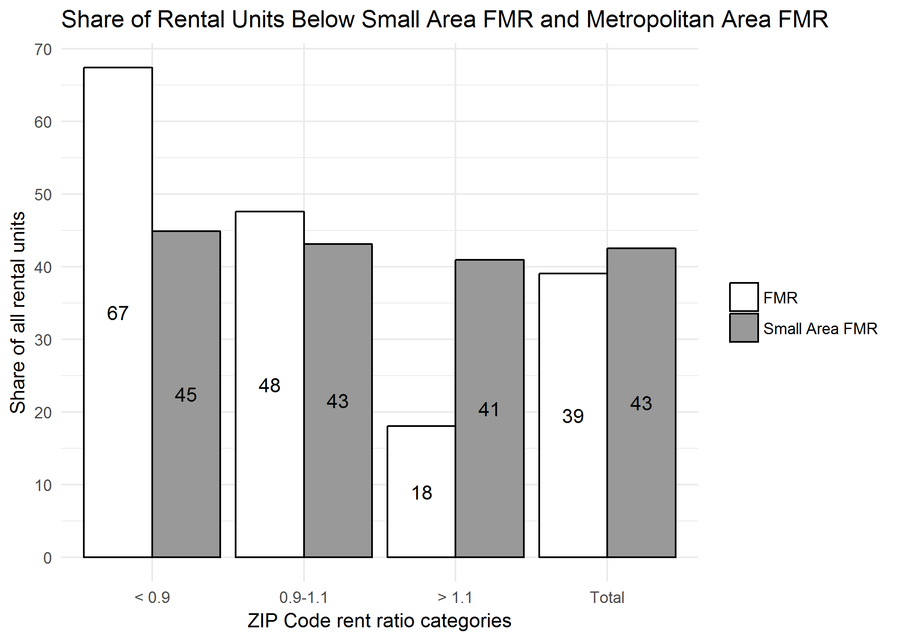

How Do Small Area FMRs Affect the Location and Number of Units Affordable to Voucher Holders?
---------------------------------------------------------------------------------------------

2018-01-30

[Full Brief](http://furmancenter.org/research/publication/how-do-small-area-fmrs-affect-the-location-and-number-of-units-affordable-t)

[ZCTA and Metro Area Excel Data Download](https://github.com/FurmanCenter/safmr/raw/master/NYU-Furman-Center_SAFMR.xlsx)

------------------------------------------------------------------------

All of the raw files, derived data, results, and code are included in this repository. However, if you would like to re-run the entire analysis you can open the file `makefile.R` where you can install all the required packages and execute all the other scripts to download files, clean data, and create the results table as a CSV and the graph as a PNG. The Metro area and ZCTA data files from the results folder are included in the Excel file linked above, which also has links to the report and column descriptions.

Each individual step in the analysis is documented with comments throughout the code, and there is a higher-level methodology at the end of the brief.

<table class="table" style="margin-left: auto; margin-right: auto;">
<thead>
<tr>
<th style="border-bottom:hidden">
</th>
<th style="border-bottom:hidden">
</th>
<th style="text-align:center; border-bottom:hidden; padding-bottom:0; padding-left:3px;padding-right:3px;" colspan="2">
Affordable Units

</th>
<th style="text-align:center; border-bottom:hidden; padding-bottom:0; padding-left:3px;padding-right:3px;" colspan="2">
Share of Units Affordable

</th>
<th style="border-bottom:hidden">
</th>
<th style="border-bottom:hidden">
</th>
</tr>
<tr>
<th style="text-align:left;">
</th>
<th style="text-align:left;">
Total Rental Units
</th>
<th style="text-align:left;">
FMR
</th>
<th style="text-align:left;">
Small Area FMR
</th>
<th style="text-align:left;">
FMR
</th>
<th style="text-align:left;">
Small Area FMR
</th>
<th style="text-align:left;">
Absolute Difference (Small Area FMR - FMR)
</th>
<th style="text-align:left;">
Percentage Change (Small Area FMR - FMR/FMR)
</th>
</tr>
</thead>
<tbody>
<tr>
<td style="text-align:left;">
All SAFMR Areas
</td>
<td style="text-align:left;">
6,400,441
</td>
<td style="text-align:left;">
2,500,661
</td>
<td style="text-align:left;">
2,723,176
</td>
<td style="text-align:left;">
39.1%
</td>
<td style="text-align:left;">
42.5%
</td>
<td style="text-align:left;">
222,515
</td>
<td style="text-align:left;">
8.9%
</td>
</tr>
<tr>
<td style="text-align:left;">
Atlanta-Sandy Springs-Roswell, GA HUD Metro FMR Area
</td>
<td style="text-align:left;">
584,755
</td>
<td style="text-align:left;">
240,664
</td>
<td style="text-align:left;">
267,765
</td>
<td style="text-align:left;">
41.2%
</td>
<td style="text-align:left;">
45.8%
</td>
<td style="text-align:left;">
27,101
</td>
<td style="text-align:left;">
11.3%
</td>
</tr>
<tr>
<td style="text-align:left;">
Bergen-Passaic, NJ HUD Metro FMR Area
</td>
<td style="text-align:left;">
170,781
</td>
<td style="text-align:left;">
57,675
</td>
<td style="text-align:left;">
64,241
</td>
<td style="text-align:left;">
33.8%
</td>
<td style="text-align:left;">
37.6%
</td>
<td style="text-align:left;">
6,566
</td>
<td style="text-align:left;">
11.4%
</td>
</tr>
<tr>
<td style="text-align:left;">
Charlotte-Concord-Gastonia, NC-SC HUD Metro FMR Area
</td>
<td style="text-align:left;">
214,574
</td>
<td style="text-align:left;">
86,395
</td>
<td style="text-align:left;">
94,177
</td>
<td style="text-align:left;">
40.3%
</td>
<td style="text-align:left;">
43.9%
</td>
<td style="text-align:left;">
7,782
</td>
<td style="text-align:left;">
9%
</td>
</tr>
<tr>
<td style="text-align:left;">
Chicago-Joliet-Naperville, IL HUD Metro FMR Area
</td>
<td style="text-align:left;">
870,900
</td>
<td style="text-align:left;">
324,163
</td>
<td style="text-align:left;">
343,921
</td>
<td style="text-align:left;">
37.2%
</td>
<td style="text-align:left;">
39.5%
</td>
<td style="text-align:left;">
19,758
</td>
<td style="text-align:left;">
6.1%
</td>
</tr>
<tr>
<td style="text-align:left;">
Colorado Springs, CO HUD Metro FMR Area
</td>
<td style="text-align:left;">
71,519
</td>
<td style="text-align:left;">
25,781
</td>
<td style="text-align:left;">
28,470
</td>
<td style="text-align:left;">
36.0%
</td>
<td style="text-align:left;">
39.8%
</td>
<td style="text-align:left;">
2,689
</td>
<td style="text-align:left;">
10.4%
</td>
</tr>
<tr>
<td style="text-align:left;">
Dallas, TX HUD Metro FMR Area
</td>
<td style="text-align:left;">
564,569
</td>
<td style="text-align:left;">
218,961
</td>
<td style="text-align:left;">
246,297
</td>
<td style="text-align:left;">
38.8%
</td>
<td style="text-align:left;">
43.6%
</td>
<td style="text-align:left;">
27,337
</td>
<td style="text-align:left;">
12.5%
</td>
</tr>
<tr>
<td style="text-align:left;">
Fort Lauderdale, FL HUD Metro FMR Area
</td>
<td style="text-align:left;">
213,688
</td>
<td style="text-align:left;">
79,774
</td>
<td style="text-align:left;">
87,189
</td>
<td style="text-align:left;">
37.3%
</td>
<td style="text-align:left;">
40.8%
</td>
<td style="text-align:left;">
7,415
</td>
<td style="text-align:left;">
9.3%
</td>
</tr>
<tr>
<td style="text-align:left;">
Fort Worth-Arlington, TX HUD Metro FMR Area
</td>
<td style="text-align:left;">
240,719
</td>
<td style="text-align:left;">
98,612
</td>
<td style="text-align:left;">
111,475
</td>
<td style="text-align:left;">
41.0%
</td>
<td style="text-align:left;">
46.3%
</td>
<td style="text-align:left;">
12,863
</td>
<td style="text-align:left;">
13%
</td>
</tr>
<tr>
<td style="text-align:left;">
Gary, IN HUD Metro FMR Area
</td>
<td style="text-align:left;">
63,166
</td>
<td style="text-align:left;">
27,636
</td>
<td style="text-align:left;">
26,386
</td>
<td style="text-align:left;">
43.8%
</td>
<td style="text-align:left;">
41.8%
</td>
<td style="text-align:left;">
-1,250
</td>
<td style="text-align:left;">
-4.5%
</td>
</tr>
<tr>
<td style="text-align:left;">
Hartford-West Hartford-East Hartford, CT HUD Metro FMR Area
</td>
<td style="text-align:left;">
121,203
</td>
<td style="text-align:left;">
49,104
</td>
<td style="text-align:left;">
48,484
</td>
<td style="text-align:left;">
40.5%
</td>
<td style="text-align:left;">
40.0%
</td>
<td style="text-align:left;">
-620
</td>
<td style="text-align:left;">
-1.3%
</td>
</tr>
<tr>
<td style="text-align:left;">
Jackson, MS HUD Metro FMR Area
</td>
<td style="text-align:left;">
50,227
</td>
<td style="text-align:left;">
20,724
</td>
<td style="text-align:left;">
21,217
</td>
<td style="text-align:left;">
41.3%
</td>
<td style="text-align:left;">
42.2%
</td>
<td style="text-align:left;">
493
</td>
<td style="text-align:left;">
2.4%
</td>
</tr>
<tr>
<td style="text-align:left;">
Jacksonville, FL HUD Metro FMR Area
</td>
<td style="text-align:left;">
145,936
</td>
<td style="text-align:left;">
58,417
</td>
<td style="text-align:left;">
64,203
</td>
<td style="text-align:left;">
40.0%
</td>
<td style="text-align:left;">
44.0%
</td>
<td style="text-align:left;">
5,786
</td>
<td style="text-align:left;">
9.9%
</td>
</tr>
<tr>
<td style="text-align:left;">
Monmouth-Ocean, NJ HUD Metro FMR Area
</td>
<td style="text-align:left;">
75,795
</td>
<td style="text-align:left;">
30,634
</td>
<td style="text-align:left;">
29,115
</td>
<td style="text-align:left;">
40.4%
</td>
<td style="text-align:left;">
38.4%
</td>
<td style="text-align:left;">
-1,519
</td>
<td style="text-align:left;">
-5%
</td>
</tr>
<tr>
<td style="text-align:left;">
North Port-Sarasota-Bradenton, FL MSA
</td>
<td style="text-align:left;">
76,418
</td>
<td style="text-align:left;">
32,035
</td>
<td style="text-align:left;">
31,087
</td>
<td style="text-align:left;">
41.9%
</td>
<td style="text-align:left;">
40.7%
</td>
<td style="text-align:left;">
-948
</td>
<td style="text-align:left;">
-3%
</td>
</tr>
<tr>
<td style="text-align:left;">
Palm Bay-Melbourne-Titusville, FL MSA
</td>
<td style="text-align:left;">
51,246
</td>
<td style="text-align:left;">
18,925
</td>
<td style="text-align:left;">
22,381
</td>
<td style="text-align:left;">
36.9%
</td>
<td style="text-align:left;">
43.7%
</td>
<td style="text-align:left;">
3,456
</td>
<td style="text-align:left;">
18.3%
</td>
</tr>
<tr>
<td style="text-align:left;">
Philadelphia-Camden-Wilmington, PA-NJ-DE-MD MSA
</td>
<td style="text-align:left;">
581,531
</td>
<td style="text-align:left;">
240,731
</td>
<td style="text-align:left;">
245,718
</td>
<td style="text-align:left;">
41.4%
</td>
<td style="text-align:left;">
42.3%
</td>
<td style="text-align:left;">
4,987
</td>
<td style="text-align:left;">
2.1%
</td>
</tr>
<tr>
<td style="text-align:left;">
Pittsburgh, PA HUD Metro FMR Area
</td>
<td style="text-align:left;">
220,210
</td>
<td style="text-align:left;">
87,734
</td>
<td style="text-align:left;">
88,737
</td>
<td style="text-align:left;">
39.8%
</td>
<td style="text-align:left;">
40.3%
</td>
<td style="text-align:left;">
1,002
</td>
<td style="text-align:left;">
1.1%
</td>
</tr>
<tr>
<td style="text-align:left;">
Sacramento--Roseville--Arden-Arcade, CA HUD Metro FMR Area
</td>
<td style="text-align:left;">
229,769
</td>
<td style="text-align:left;">
93,206
</td>
<td style="text-align:left;">
97,508
</td>
<td style="text-align:left;">
40.6%
</td>
<td style="text-align:left;">
42.4%
</td>
<td style="text-align:left;">
4,302
</td>
<td style="text-align:left;">
4.6%
</td>
</tr>
<tr>
<td style="text-align:left;">
San Antonio-New Braunfels, TX HUD Metro FMR Area
</td>
<td style="text-align:left;">
242,058
</td>
<td style="text-align:left;">
84,650
</td>
<td style="text-align:left;">
108,635
</td>
<td style="text-align:left;">
35.0%
</td>
<td style="text-align:left;">
44.9%
</td>
<td style="text-align:left;">
23,986
</td>
<td style="text-align:left;">
28.3%
</td>
</tr>
<tr>
<td style="text-align:left;">
San Diego-Carlsbad, CA MSA
</td>
<td style="text-align:left;">
429,988
</td>
<td style="text-align:left;">
168,800
</td>
<td style="text-align:left;">
177,962
</td>
<td style="text-align:left;">
39.3%
</td>
<td style="text-align:left;">
41.4%
</td>
<td style="text-align:left;">
9,162
</td>
<td style="text-align:left;">
5.4%
</td>
</tr>
<tr>
<td style="text-align:left;">
Tampa-St. Petersburg-Clearwater, FL MSA
</td>
<td style="text-align:left;">
330,210
</td>
<td style="text-align:left;">
135,180
</td>
<td style="text-align:left;">
142,669
</td>
<td style="text-align:left;">
40.9%
</td>
<td style="text-align:left;">
43.2%
</td>
<td style="text-align:left;">
7,489
</td>
<td style="text-align:left;">
5.5%
</td>
</tr>
<tr>
<td style="text-align:left;">
Urban Honolulu, HI MSA
</td>
<td style="text-align:left;">
102,358
</td>
<td style="text-align:left;">
34,525
</td>
<td style="text-align:left;">
41,486
</td>
<td style="text-align:left;">
33.7%
</td>
<td style="text-align:left;">
40.5%
</td>
<td style="text-align:left;">
6,961
</td>
<td style="text-align:left;">
20.2%
</td>
</tr>
<tr>
<td style="text-align:left;">
Washington-Arlington-Alexandria, DC-VA-MD HUD Metro FMR Area
</td>
<td style="text-align:left;">
612,177
</td>
<td style="text-align:left;">
235,311
</td>
<td style="text-align:left;">
273,627
</td>
<td style="text-align:left;">
38.4%
</td>
<td style="text-align:left;">
44.7%
</td>
<td style="text-align:left;">
38,316
</td>
<td style="text-align:left;">
16.3%
</td>
</tr>
<tr>
<td style="text-align:left;">
West Palm Beach-Boca Raton, FL HUD Metro FMR Area
</td>
<td style="text-align:left;">
136,643
</td>
<td style="text-align:left;">
51,030
</td>
<td style="text-align:left;">
60,431
</td>
<td style="text-align:left;">
37.3%
</td>
<td style="text-align:left;">
44.2%
</td>
<td style="text-align:left;">
9,402
</td>
<td style="text-align:left;">
18.4%
</td>
</tr>
</tbody>
</table>

------------------------------------------------------------------------

